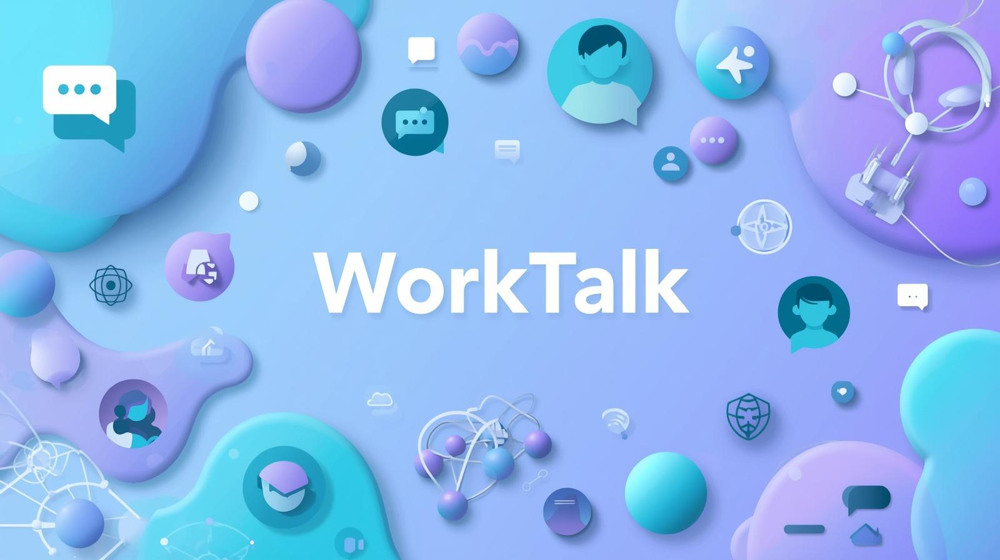
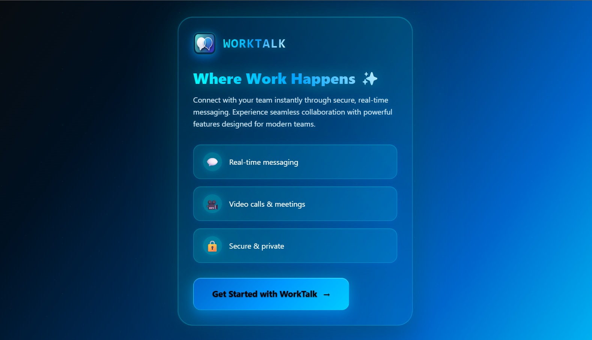
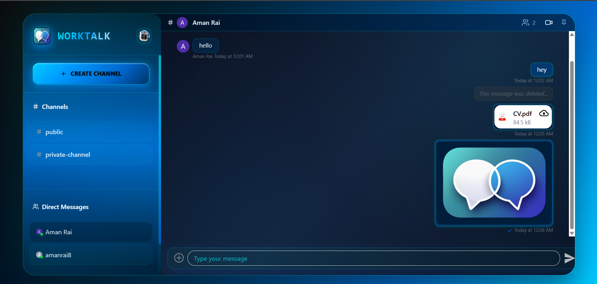
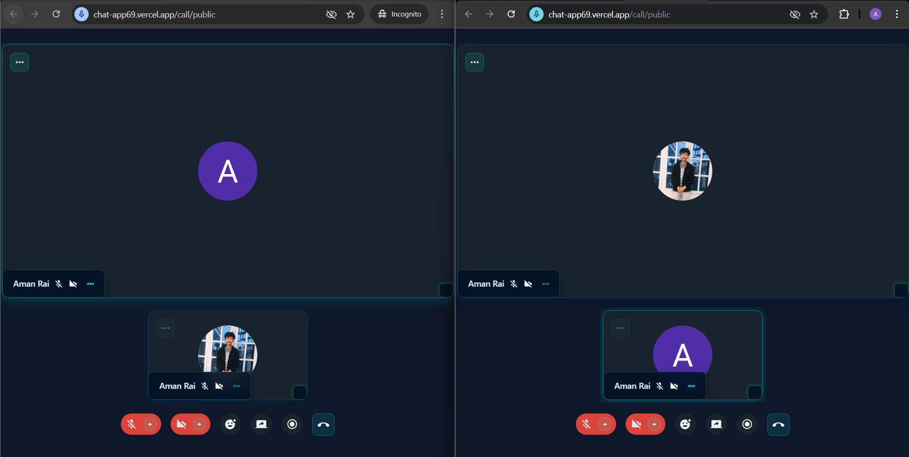

# 🚀 WorkTalk – Where Work Happens ✨

<p align="center">
  <a href="https://github.com/AmanRai8/WorkTalk/stargazers">
    
  </a>
  <a href="https://github.com/AmanRai8/WorkTalk/network/members">
    
  </a>
  <a href="https://github.com/AmanRai8/WorkTalk/issues">
    
  </a>
  <a href="https://github.com/AmanRai8/WorkTalk/blob/main/LICENSE">
    
  </a>
</p>
WorkTalk is a modern **team collaboration app** built with the **MERN stack** and powered by **Clerk, Stream, Inngest, and Sentry**.  
Think of it as a **lightweight Slack alternative** – simple, fast, and designed for seamless teamwork.

---

## 🌟 Features

✅ Real-time messaging with **Stream**  
✅ Video calls & meetings 🎥  
✅ Secure authentication with **Clerk** 🔑  
✅ Background jobs & event-driven workflows using **Inngest** ⚡  
✅ Error tracking & monitoring with **Sentry** 🛡️  
✅ Responsive, mobile-friendly design 📱  
✅ Channel-based communication + Direct Messages 💬

---

## 📸 Screenshots

### Auth Page



### Chat Page



### Call Page



## [⬆ Back to Top](#-worktalk--where-work-happens-)

## 🛠️ Tech Stack

| Category             | Technologies Used   |
| -------------------- | ------------------- |
| **Frontend**         | React, Tailwind CSS |
| **Backend**          | Node.js, Express    |
| **Database**         | MongoDB             |
| **Auth**             | Clerk               |
| **Chat & Messaging** | Stream              |
| **Background Jobs**  | Inngest             |
| **Monitoring**       | Sentry              |

---

## ⚡ Quick Start

```bash
# Clone the repo
git clone https://github.com/AmanRai8/chat_app.git

# Move into project
cd chat_app

# Install dependencies
npm install
```

## 🔑 Environment Variables

Create a `.env` file in the root and add:

```bash
VITE_CLERK_PUBLISHABLE_KEY=your_clerk_publishable_key
VITE_STREAM_API_KEY=your_stream_api_key
VITE_SENTRY_DSN=your_sentry_dsn_key
VITE_API_BASE_URL=your_api_base_url
```

# Start dev server

```bash
npm run dev
```

## 🤝 Contributing

Contributions are welcome!

1. Fork the repo
2. Create a new branch (`git checkout -b feature-branch`)
3. Commit changes (`git commit -m "Added new feature"`)
4. Push (`git push origin feature-branch`)
5. Open a Pull Request

## [⬆ Back to Top](#-worktalk--where-work-happens-)
